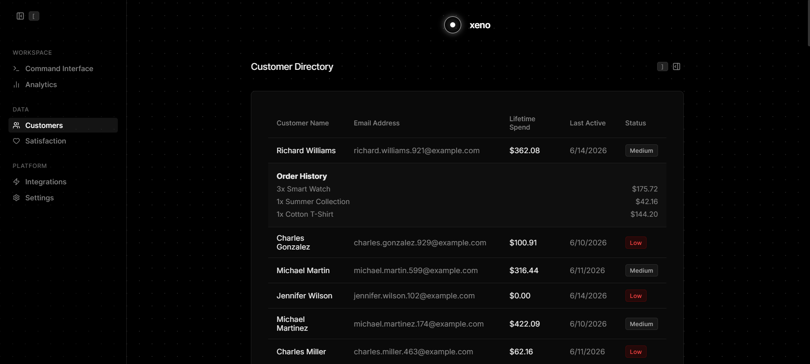
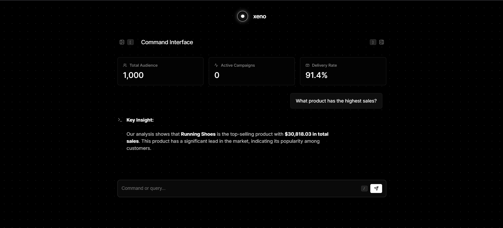
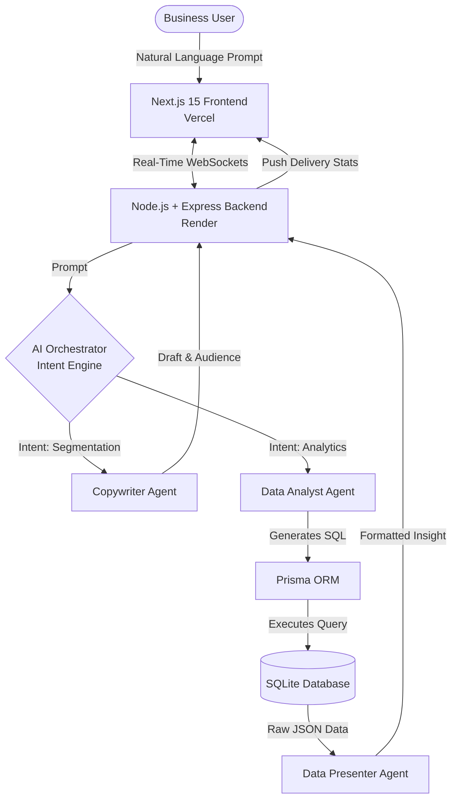

# Xeno CRM: Enterprise AI Orchestration Platform 🚀

[](https://xeno-crm-bice-kappa.vercel.app/)
[]()
[]()
[]()
[]()

<!-- 📸 PHOTO PLACEHOLDER 1: Add a high-quality Hero Banner image here -->
<div align="center">
  
</div>

<br>

**Xeno CRM** is a modern, highly interactive Customer Relationship Management platform featuring a cinematic user interface, real-time WebSocket communication, and an autonomous Multi-Agent AI architecture. Designed with a "Nothing Tech" glassmorphic aesthetic, it delivers a premium, enterprise-grade experience.

---

## 🌟 Live Cloud Deployment
The application is fully hosted on the cloud. The frontend is deployed via **Vercel** and the backend API (including WebSockets and AI routing) is hosted on **Render**.

👉 **[Launch Frontend (Vercel)](https://xeno-crm-bice-kappa.vercel.app/)**  
👉 **[Backend API Endpoint (Render)](https://xeno-crm-st4n.onrender.com)**

<!-- 📸 PHOTO PLACEHOLDER 2: Add a GIF or Screenshot of the Dashboard here -->
<div align="center">
  <br>
  
  <p><i>Xeno CRM's cinematic interface and Multi-Agent AI in action.</i></p>
</div>

---

## ✨ Enterprise Business Features

- **Advanced AI Intent Detection (BI Analytics):** The Orchestrator AI now possesses a dual-intent engine. It intelligently differentiates between a **Segmentation Request** (e.g., "Target VIP customers for a campaign") and an **Analytical Request** (e.g., "What product generated the highest sales?"). For analytics, it executes complex SQL `JOIN`s and utilizes a separate Data Presenter LLM to output beautifully formatted, natural-language business insights directly into the chat.
- **Dynamic Customer Profiling:** The Customer Directory scales dynamically from the database. Users can click on any individual row to elegantly slide open a "Profile Module" which queries their historical transaction records (exact products, quantities, and order amounts).
- **Interactive Satisfaction Drill-Downs:** Visual funnel bars on the dashboard are fully interactive. Clicking a satisfaction tier (e.g., "1 Star Rating") seamlessly queries the SQLite database and expands to reveal exactly which users left that rating, along with their raw text feedback.
- **Multi-Agent AI Architecture:** When drafting campaigns, the Orchestrator AI delegates tasks to specialized sub-agents:
  - **Query Agent:** Translates human intent into raw SQLite database segmentation queries.
  - **Copywriter Agent:** Drafts personalized, high-converting marketing copy.
- **Real-Time WebSocket Infrastructure:** Replaces traditional HTTP polling with persistent **Socket.io WebSockets**. Live campaign status updates (Drafting → Generating Audience → Executing) are pushed instantly to the dashboard.

<!-- 📸 PHOTO PLACEHOLDER 3: Add a Screenshot of the new Analytical Insight AI Chat response here -->
<div align="center">
  <br>
  
  <p><i>The AI generating raw analytical insights via database querying.</i></p>
</div>

---

## 🔒 Enterprise Security Aspects

1. **AI Output Sanitization & Strict Intent:** The execution of AI-generated SQL queries is strictly sandboxed. The prompt architecture explicitly defines bounds (no malicious schemas) and Prisma handles database execution securely to minimize injection vectors.
2. **Environment Variable Protection:** All API Keys (Groq) and Database configurations are stripped from the source code and securely injected via Vercel/Render encrypted Environment Variables.
3. **CORS Configuration:** Cross-Origin Resource Sharing is strictly configured to ensure only the authorized Vercel frontend domain can interface with the Render backend API.

---

## 🏗️ Architecture & Tech Stack

This repository is organized as a full-stack monorepo:

- **/frontend**: Next.js 15 (App Router), CSS Modules, Framer Motion
- **/backend**: Node.js + Express, Prisma ORM, SQLite, Socket.io
- **AI Core**: Groq/Llama-3-based Orchestrator with Multi-Agent delegation

### System Architecture Diagram



---

## 🚀 Running Locally

To run the full stack locally on your own machine:

**1. Clone & Install**
```bash
git clone https://github.com/Ssr446/Xeno-CRM.git
cd Xeno-CRM
```

**2. Start the Backend**
```bash
cd backend
npm install
npm start
```
*The backend will run on http://localhost:3001*

**3. Start the Frontend**
```bash
cd ../frontend
npm install
npm run dev
```
*The frontend will run on http://localhost:3000*
